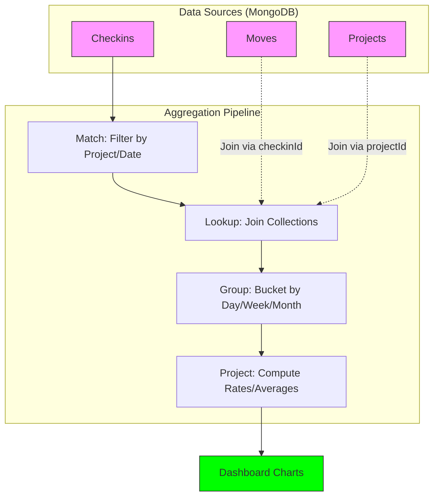

# Analytics & Queries



# Analytics Data Extraction Guide (MongoDB)

This document explains how data is extracted from MongoDB to power the Rayuela Analytics Dashboard. It details the aggregation pipelines, technical constraints, and data modeling strategies used in the `AnalyticsDao`.

## 1. Data Model Overview

The analytics engine primarily queries three collections:

- **Checkins (`checkins`)**: Recorded events when a volunteer performs a task.
  - Key fields: `userId`, `projectId`, `datetime`, `contributesTo`.
- **Moves (`moves`)**: Gamification events associated with a checkin.
  - Key fields: `checkinId` (String), `newPoints`, `newBadges`.
- **Projects (`projects`)**: Context for checkins.
  - Key fields: `_id` (ObjectId), `name`, `gamificationStrategy`, etc.

## 2. Technical Constraints & Helpers

### 2.1 MongoDB Version Compatibility
The environment uses MongoDB versions that may not support `$dateTrunc` (requires 5.0+). To ensure compatibility with MongoDB 3.6+, we use a custom `buildDateBucket` helper.

**Helper: `buildDateBucket(granularity, field)`**
Groups dates by day, week (ISO), or month using `$dateToString` and `$dateFromParts`.

```javascript
// Example: Weekly bucket (ISO Monday)
{
  $dateFromParts: {
    isoWeekYear: { $isoWeekYear: "$datetime" },
    isoWeek: { $isoWeek: "$datetime" },
    isoDayOfWeek: 1
  }
}
```

### 2.2 Type Mismatch Handling (String vs ObjectId)
In the Rayuela schema, `projectId` and `checkinId` are often stored as `String` in secondary collections, while the primary `_id` is an `ObjectId`. Standard `localField/foreignField` lookups fail silently.

**Helper: `lookupByStringId(from, localField, as)`**
Uses an expressive `$lookup` with `$toString` to match types.

```javascript
{
  $lookup: {
    from: "projects",
    let: { refId: "$projectId" },
    pipeline: [
      { $match: { $expr: { $eq: [{ $toString: "$_id" }, "$$refId"] } } }
    ],
    as: "project"
  }
}
```

---

## 3. Core Aggregation Pipelines

### 3.1 Checkins Over Time
**Endpoint**: `/analytics/checkins-over-time`
**Goal**: Count checkins grouped by the selected granularity.

```javascript
[
  { $match: { projectId: "..." } }, // Optional
  { $match: { datetime: { $gte: ISODate("..."), $lte: ISODate("...") } } }, // Optional
  {
    $group: {
      _id: buildDateBucket(granularity, "datetime"),
      count: { $sum: 1 }
    }
  },
  { $sort: { _id: 1 } }
]
```

### 3.2 Active Users Over Time
**Endpoint**: `/analytics/active-users-over-time`
**Goal**: Count unique `userId`s per time bucket.

```javascript
[
  { $match: { ... } },
  {
    $group: {
      _id: {
        period: buildDateBucket(granularity, "datetime"),
        userId: "$userId"
      }
    }
  },
  {
    $group: {
      _id: "$_id.period",
      uniqueUsers: { $sum: 1 }
    }
  },
  { $sort: { _id: 1 } }
]
```

### 3.3 Strategy Breakdown
**Endpoint**: `/analytics/by-strategy`
**Goal**: Compare project performance (checkins, points, users) based on their active gamification strategies.

**Pipeline Steps**:
1. **Join Project**: Get strategy metadata.
2. **Join Move**: Get points awarded for each checkin.
3. **Group by Project**: Calculate totals.
4. **Project Results**: Compute `avgPointsPerCheckin` and `activeUsers` (via `$size` of a `$addToSet` array).

---

## 4. Conceptual Execution

To understand how these queries work, let's take **Checkins Over Time** as an example of the "Filter -> Transform -> Aggregate" flow:

1.  **Filtering (`$match`)**: The database first narrows down the documents. Instead of looking at millions of checkins, it only keeps those belonging to a specific `projectId` or within a `startDate`/`endDate` range. **Conceptual thought: "Only give me checkins from Project A in 2024."**
2.  **Bucketization (`$group._id`)**: This is the most complex step. The query looks at each checkin's `datetime` (e.g., `2024-05-15T14:30:00Z`) and "truncates" it into a bucket. If the granularity is "month", every checkin in May 2024 gets the same ID: `2024-05-01`. **Conceptual thought: "Put every checkin into a box labeled with its month."**
3.  **Counting (`$sum: 1`)**: Once the "boxes" (buckets) are created, the database counts how many checkins are inside each one. **Conceptual thought: "Count the items in each box."**
4.  **Sorting (`$sort`)**: Finally, the buckets are ordered by date so the dashboard can draw a continuous line from past to present.

---

## 5. Performance Analysis & Warnings

As the platform scales to **thousands or millions of records**, certain queries will degrade significantly. Developers should be aware of the following bottlenecks:

### 5.1 The "Cross-Collection" Penalty (`$lookup`)
Queries like **Points Over Time** or **Badge Acquisition** are the most dangerous. Because `Moves` do not store `projectId`, we must perform a `$lookup` join to the `Checkins` collection for every single Move to filter by project.
- **Risk**: If there are 1 million Moves, the database might perform 1 million lookups.
- **Warning**: These queries will become extremely slow unless `checkinId` is indexed in the `moves` collection and `projectId` is indexed in `checkins`.

### 5.2 Array Expansion Memory Leak (`$unwind`)
The **Badge Acquisition** query uses `$unwind: "$newBadges"`.
- **Risk**: If a user earns 10 badges in a single checkin, `$unwind` transforms that 1 document into 10 separate documents in-memory.
- **Degradation**: If you are processing 500k checkins and each has several badges, the intermediate data size can explode, potentially hitting MongoDB's 100MB aggregation memory limit.

### 5.3 Double-Grouping Bottleneck
**Active Users Over Time** groups data twice: first to find unique users per period, and then to count those users.
- **Risk**: The first `$group` creates a unique entry for every user-period combination. If 10,000 users check in daily over a year, that's 3.65 million intermediate entries.
- **Degradation**: This query's execution time grows linearly with the number of unique user interactions.

### 5.4 Recommendation for Massive Scale
If the data grows to millions of records, we should consider **Pre-aggregation (Materialized Views)**:
- Instead of calculating metrics on the fly, a background task could update a `daily_stats` collection every night.
- The dashboard would then query the 365 rows of `daily_stats` instead of 1,000,000 rows of `checkins`.
