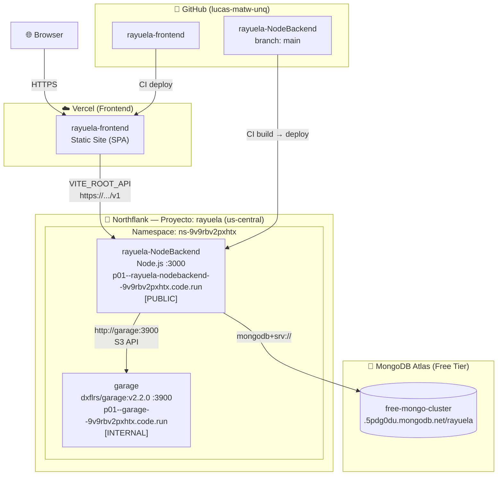

# Deployment & Infrastructure

This page describes the architecture, infrastructure, and continuous integration process for the Rayuela platform.

## Architecture Diagram

## Core Infrastructure

### 1. Backend: Northflank
The backend services are orchestrated in a Northflank project named `rayuela`.

- **rayuela-NodeBackend**: 
  - NestJS application running on Node.js.
  - Exposed publicly via Northflank's generated domain on port 3000.
  - Connected to GitHub for automated Continuous Deployment.
- **garage**:
  - S3-compatible object storage provider.
  - **Docker Image**: `dxflrs/garage:v2.2.0` (Docker Hub).
  - **Internal Service**: Accessible only within the Northflank project network at `http://garage:3900`.
  - **Configuration**: Managed via a custom runtime file at `/etc/garage.toml`.
  - **Command**: `/garage -c /etc/garage.toml server`.

### 2. Frontend: Vercel
The frontend is a Vue.js Single Page Application (SPA).
- **Hosting**: Vercel.
- **Deployment**: Automatic deployments from the `main` branch.
- **Rewrites**: Configured via `vercel.json` to handle SPA routing.

### 3. Database: MongoDB Atlas
- **Tier**: M0 (Free Tier).
- **Cluster**: `free-mongo-cluster`.
- **Access**: IP whitelist configured for Northflank egress IPs.

---

## Continuous Integration & Delivery

Rayuela implements a robust CI/CD pipeline to ensure code quality and automated updates.

### GitHub Actions (CI)
Every pull request and push to the `main` branch triggers the **Node.js CI** workflow:
- **Environment**: Tested against multiple Node.js versions (16.x, 18.x).
- **Quality Gates**:
  - `npm install`: Verifies dependency resolution.
  - `npm run lint`: Enforces code style consistency (ESLint).
  - `npm test`: Executes the Jest test suite.
- **Requirement**: CI must pass before any deployment to the stage environment.

### Automated Delivery (CD)
- **Frontend (Vercel)**: Pushes to `main` are automatically built and deployed.
- **Backend (Northflank)**: Northflank tracks the GitHub repository and triggers a new build/deployment cycle upon code changes, provided CI checks pass.
- **Secrets**: Production secrets (JWT, S3 keys, DB URIs) are injected at runtime via Northflank Secret Groups and Vercel Environment Variables, never stored in the repository.

## Environment Variables (Backend)

| Variable | Description | Value (Stage) |
|----------|-------------|---------------|
| `DB_CONNECTION` | MongoDB connection string | `mongodb+srv://...` |
| `JWT_SECRET` | Secret key for JWT signing | `fda6c62...` |
| `S3_ENDPOINT` | Garage S3 API endpoint | `http://garage:3900` |
| `S3_ACCESS_KEY` | Garage Access Key | `GKeb4b3...` |
| `S3_SECRET_KEY` | Garage Secret Key | `65cbf33...` |
| `S3_BUCKET` | S3 bucket for check-ins | `rayuela-checkins` |
| `S3_REGION` | S3 region identifier | `garage` |
| `NOREPLY_EMAIL` | Email for notifications | `unqarq2@gmail.com` |
| `FRONTEND_URL` | Production Frontend URL | `https://rayuela-frontend-nine.vercel.app` |
| `NODE_ENV` | Environment mode | `production` |
