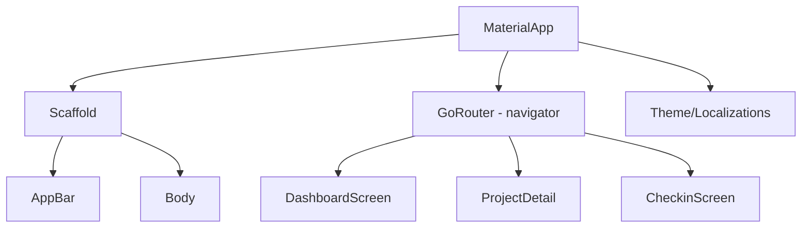
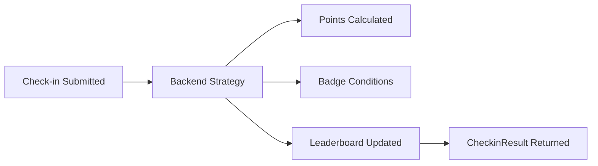

# Rayuela Mobile Architecture

Welcome to the Rayuela Mobile architecture deep-dive. This documentation is designed for web and backend developers who are new to Flutter and want to understand how the mobile application is structured.

## 🎯 Flutter 101 — For Web/Backend Developers

Flutter is Google's UI framework that compiles to native iOS and Android apps from a single Dart codebase. Unlike React Native, which uses a JavaScript bridge, Flutter renders its own pixels directly using its own engine.

### Key Concepts

| Concept | Description |
| :--- | :--- |
| **Widget = Component** | Everything is a Widget. Just like React components, widgets are composable, immutable, and describe the UI declaratively. |
| **BuildContext = React Context** | The `BuildContext` is a handle to the widget tree. It's how you access themes, localization, navigation, and state from any widget. |
| **StatefulWidget = useState** | Widgets can hold local state. However, in Rayuela, we use Riverpod providers for most global and feature-level state. |
| **Dart = TypeScript but stricter** | Dart has null-safety, sealed classes, pattern matching, and async/await. It will feel very familiar if you know TypeScript. |

### Flutter's Widget Tree

> **Key insight:** Flutter has no HTML/DOM. Everything you see on screen is a widget rendered by Flutter's own engine. It draws directly to a canvas, similar to a game engine.

---

## 🎮 Business Concepts

Rayuela is a **citizen science platform**. Volunteers subscribe to environmental monitoring projects and submit geo-tagged photo check-ins from the field.

### Core Entities

*   **Projects**: Top-level units. Each project has areas (map zones), task types, a gamification strategy, and a leaderboard.
*   **Areas**: GeoJSON polygons within a project (e.g., "Zone A", "Riverbank"). Tasks are assigned to areas and shown on an interactive map.
*   **Tasks**: Citizen-science activities tagged with a `taskType` (e.g., "Observation", "Photo report").
*   **Check-ins**: A volunteer's submission: GPS + photos + task type. The backend awards points and badges in response.

### Gamification Architecture

After each check-in, the backend computes points and badge awards using its gamification strategy (BASIC or ELASTIC), returning the delta to the mobile app.

### User Roles

| Role | Mobile Access | Notes |
| :--- | :--- | :--- |
| **Volunteer** | Full Access | Can subscribe, submit check-ins, and view leaderboards. |
| **Admin** | Blocked | Admin functionality is exclusive to the Vue web application. |

### Subscription Model

Projects are **opt-in**. Users must subscribe to a project for it to appear on their dashboard and for gamification to be active.
