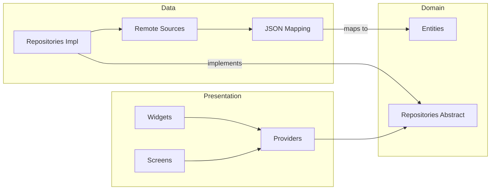

# Project & Feature Architecture

Rayuela Mobile follows a **feature-first** layout and implements **Clean Architecture** principles within each feature.

## 📁 Project Structure

The `lib/` directory is organized by feature. Nothing is shared across features unless it lives in `core/` or `shared/`.

```text
lib/
├── main.dart               # Entry point, calls bootstrap()
├── app/                    # Bootstrap logic and root widget
├── core/                   # Cross-cutting infrastructure
│   ├── config/             # Environment variables
│   ├── network/            # ApiClient and interceptors
│   ├── router/             # GoRouter configuration
│   └── theme/              # Material 3 theme and colors
├── features/               # Business features
│   ├── auth/               # Auth: domain, data, presentation
│   ├── dashboard/          # Project list and details
│   ├── checkin/            # Photo upload workflow
│   ├── tasks/              # Task lists
│   └── leaderboard/        # Rankings
├── shared/                 # Reusable code
│   ├── providers/          # Core providers (API, tokens)
│   ├── widgets/            # Common UI components
│   └── utils/              # Helpers
└── l10n/                   # Localization strings (EN, ES, PT)
```

---

## 🏗️ Feature Architecture

Each feature is divided into three layers. Data flows **inward**: the HTTP response becomes a DTO, the DTO is mapped to a Domain Entity, and the Entity is consumed by the Presentation layer.



### Layer Responsibilities

| Layer | Responsibility | Contents |
| :--- | :--- | :--- |
| **Presentation** | UI and State | Screens, Widgets, Riverpod Controllers |
| **Domain** | Business Logic & Rules | Entities, Repository Interfaces |
| **Data** | External Data Access | API Sources, DTOs, Repository Implementations |

### Why DTOs?
The backend (NestJS/MongoDB) often uses underscore-prefixed fields (e.g., `_id`). DTOs handle this mapping defensively to keep the Domain Entities clean.

```dart
// DTO mapping example
class ProjectDto {
  static String _firstString(Map json, List<String> keys) {
    for (var key in keys) {
      if (json[key] != null) return json[key];
    }
    return '';
  }
}
```
