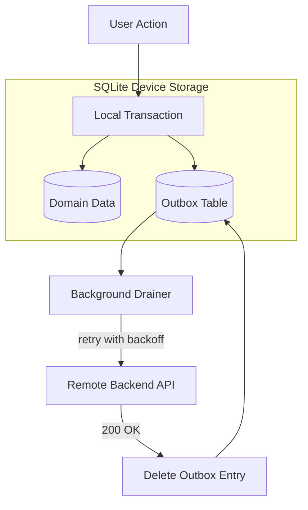
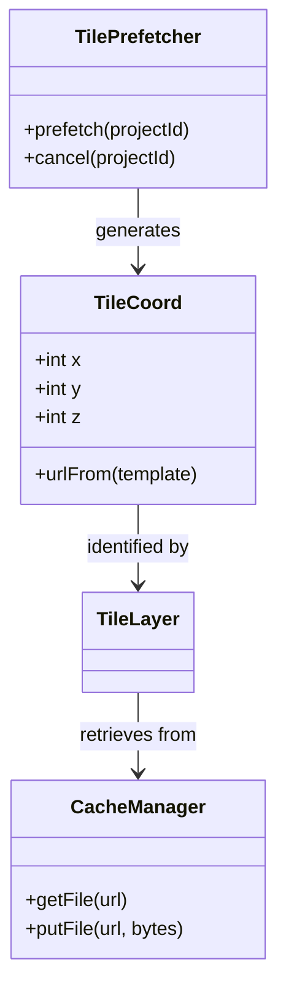
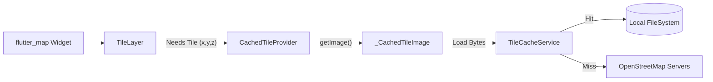
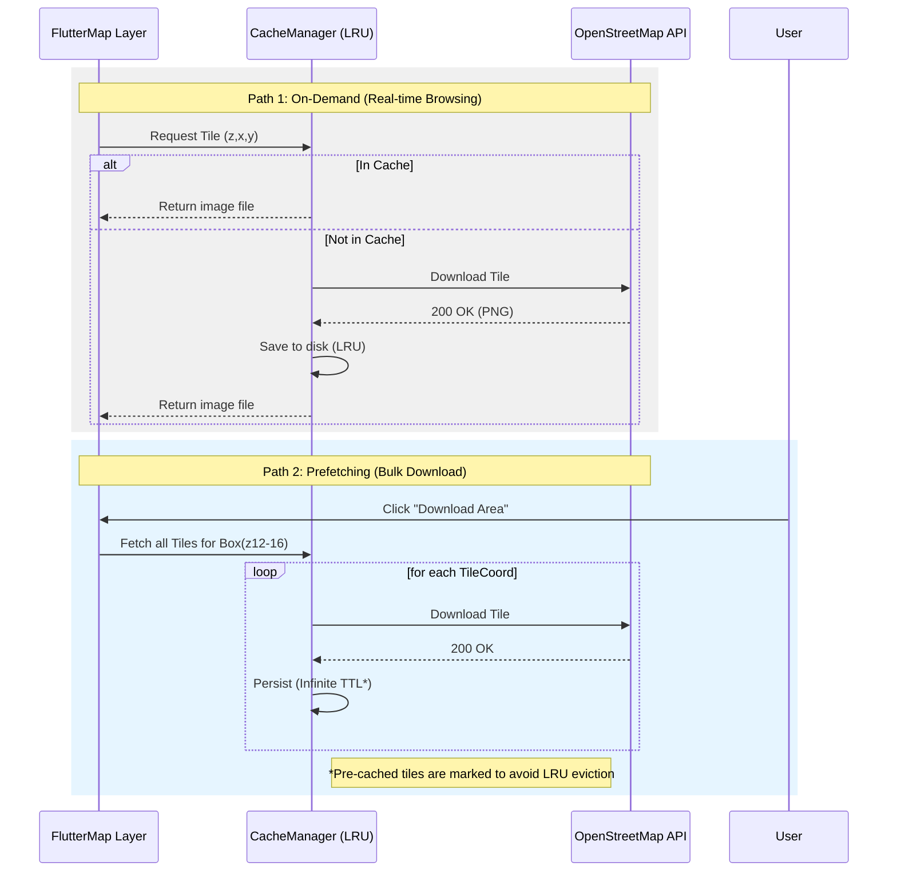
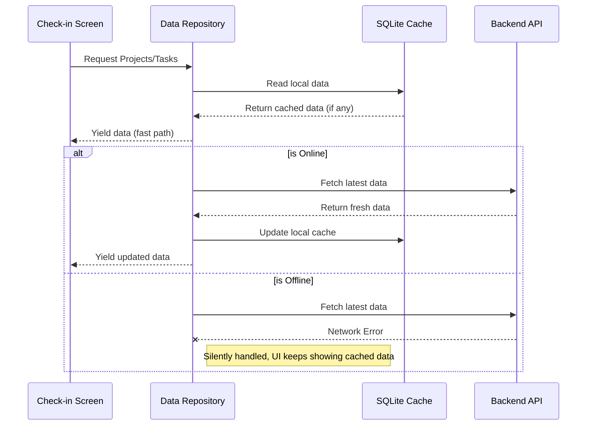
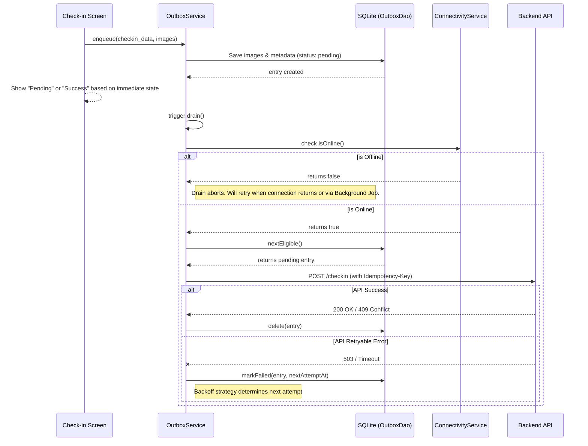
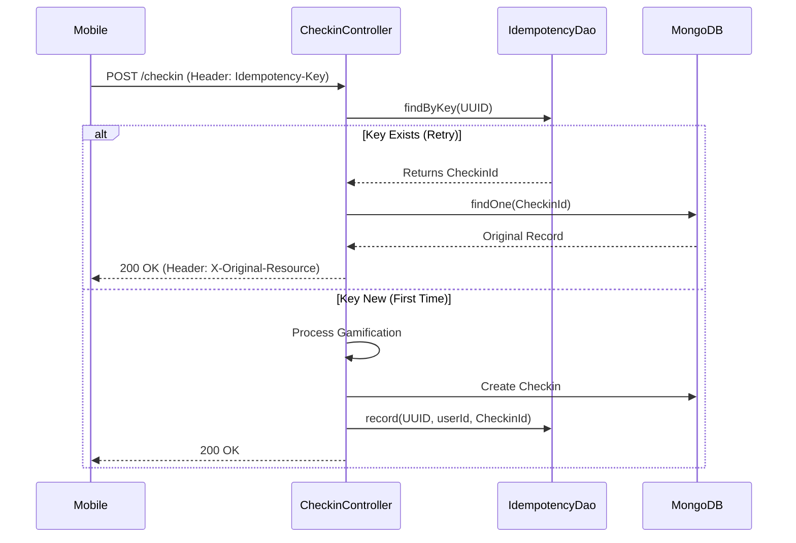

# Offline Sync Architecture

This document summarizes the architecture and implementation of the **Offline Sync** feature introduced in `rayuela-mobile` PR #1 and `rayuela-NodeBackend` PR #42.

## 1. Fundamental Concepts

The system follows **Local-First** principles. Instead of the app failing when the network is absent, it treats the device's storage as the "source of truth" for pending actions.

*   **Outbox Pattern:** Actions (check-ins) are serialized into a queue (SQLite) immediately. Sending to the server happens asynchronously.
*   **Idempotency:** Every check-in is assigned a UUID `Idempotency-Key`. This ensures that if a sync is interrupted and retried, the server doesn't create duplicate check-ins.
*   **Stale-While-Revalidate:** For reading data (projects/tasks), the app shows the cached version from SQLite first, then updates it if a network connection is available.

## 2. Key Libraries Involved

| Category | Libraries |
| :--- | :--- |
| **Data & Sync** | `sqflite`, `connectivity_plus`, `workmanager`, `uuid` |
| **Media & Maps** | `flutter_cache_manager`, `latlong2` |

## 3. Architectural Patterns

### The Outbox Pattern

The **Outbox Pattern** ensures reliable data synchronization. Instead of sending data directly to an API and failing if the network is down, the application saves the data and the *intent to send* in a single local atomic operation.

**Benefits:**
*   **Guaranteed Delivery:** Data remains in the Outbox until the server confirms receipt.
*   **UI Responsiveness:** User sees "Success" instantly due to fast local save.
*   **Offline Resilience:** Identical logic regardless of connectivity state.

### The "Outbox" Flow in Rayuela

1.  **Persistence:** Images saved to filesystem via `ImageStore`; metadata to SQLite via `OutboxDao`.
2.  **Reactive Trigger:** `OutboxLifecycle` detects new entries or "online" events and calls `OutboxService.drain()`.
3.  **Strategic Retry:** `JitteredExponentialBackoff` handles server downtime (e.g., 5s, 1m, 30m).

## 4. Offline Tiles Handling

The map subsystem supports persistent tile storage and proactive prefetching using **Slippy Map** math.

### UML: Offline Map Subsystem

### Visual Rendering Bridge

The visual map component (`flutter_map`) connects to caching via a custom `CachedTileProvider`.

### Tile Caching Lifecycle

## 5. Background Sync Strategy

*   **Foreground:** Triggered by `ConnectivityService` and `AppLifecycleState.resumed`.
*   **Background:** `WorkManager` (Android) and `BGTaskScheduler` (iOS) wake up the app approximately every **1 hour** to attempt a drain.

## 6. Sequence Diagrams

### Flow A: Opening the Check-in View (Data Fetching)

### Flow B: Check-in Submission (The Outbox Flow)

## 7. Backend Supporting Changes (PR #42)

The backend is **Idempotent-Aware**, ensuring that mobile retries do not corrupt data or double-count points.

### The Idempotency Lifecycle

### Key Considerations

*   **TTL Eviction:** Idempotency keys expire after **7 days** via MongoDB TTL index.
*   **Active Probing:** New `/health` endpoint for mobile reachability detection.
*   **Error Classification:** `MulterExceptionFilter` maps file errors to 4xx codes to guide outbox retry behavior.
