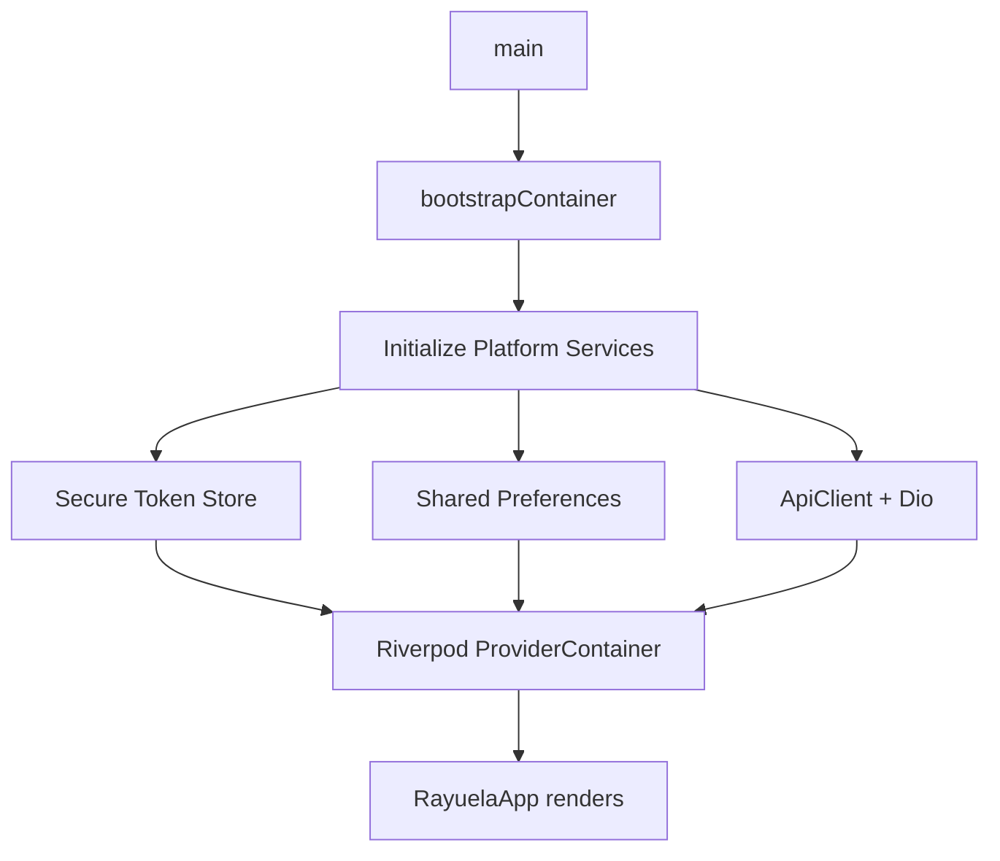

# Technical Implementation Details

This section covers the core technical pillars of the Rayuela Mobile application.

## 🚀 App Startup Sequence

Before any screen appears, `bootstrap.dart` wires all dependencies. This is similar to a NestJS bootstrap function that configures modules and injects providers.



### Initial Navigation
The `SplashScreen` is the entry point. it calls `AuthController.bootstrap()` to check for an existing session. Depending on the result, `GoRouter` automatically redirects to `/login` or `/dashboard`.

---

## ⚡ State Management — Riverpod

Riverpod is our dependency injection and state management system. It acts like a type-safe combination of **Singleton services** and **React Context/Hooks**.

### Key Provider Types

| Provider | Usage |
| :--- | :--- |
| `Provider<T>` | Synchronous, constant services (e.g., `apiClientProvider`). |
| `StateNotifierProvider` | Mutable state with explicit transitions (e.g., `authControllerProvider`). |
| `FutureProvider` | Asynchronous data loading (e.g., `subscribedProjectsProvider`). |

### Reading State in a Widget

```dart
class DashboardScreen extends ConsumerWidget {
  @override
  Widget build(BuildContext context, WidgetRef ref) {
    // ref.watch rebuilds this widget when the value changes
    final projects = ref.watch(subscribedProjectsProvider);

    return projects.when(
      loading: () => LoadingView(),
      error: (err, _) => ErrorView(error: err),
      data: (list) => ProjectsList(projects: list),
    );
  }
}
```

---

## 🗺️ Navigation — GoRouter

GoRouter handles URL-based routing and deep-linking. It also manages authentication-based redirects.

```mermaid
graph TD
    Auth[Auth State Changes] --> Refresh[GoRouter Refreshes]
    Refresh --> Check{Is Authenticated?}
    Check -- No --> Login[/login]
    Check -- Yes --> Dashboard[/dashboard]
```

### Route Map

| Path | Name | Screen | Auth Required |
| :--- | :--- | :--- | :--- |
| `/` | `splash` | SplashScreen | No |
| `/login` | `login` | LoginScreen | No |
| `/dashboard` | `dashboard` | DashboardScreen | Yes |
| `/project/:projectId` | `project-detail`| ProjectDetailScreen | Yes |

---

## 🌐 Network Layer — Dio

All HTTP requests pass through a **Dio** interceptor pipeline.

### Interceptor Flow
1. **AuthInterceptor**: Injects the Bearer token into outgoing requests.
2. **LoggingInterceptor**: Logs requests and responses in debug mode.
3. **RefreshInterceptor**: Automatically attempts to refresh the access token if a `401 Unauthorized` is received.

### Error Handling
We use **Railway-Oriented Programming**. Functions return a `Result<T>` (Success or Failure) instead of throwing exceptions.

```dart
sealed class Result<T> {
  R fold<R>({
    required R Function(T) onSuccess,
    required R Function(AppException) onFailure,
  });
}
```

---

## 🔐 Authentication Flow

Auth state is managed as a sealed union state machine: `Initial`, `Unauthenticated`, and `Authenticated`.

### Google Sign-In
1. Mobile calls Google SDK.
2. Returns an `idToken`.
3. Mobile sends `idToken` to `POST /auth/google`.
4. If the user is new, the backend may return a `requiresUsername` flag, triggering a registration step in the app.
