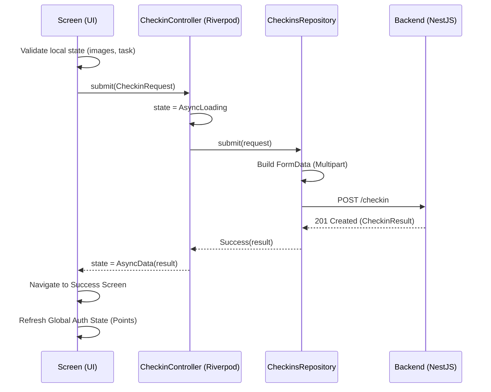

# Check-in UI Dissected

This section provides a deep-dive into the actual Check-in screen. Every visible element maps to a specific architectural concept — a Riverpod provider, a navigation parameter, a platform plugin, or local widget state.

←
Eco Survey Project
1

What kind of check-in?

Observation

Measurement

2

Photos · 0/3

Add up to 3 photos to support your observation.

📷 Camera

🖼 Gallery

3

Location

📍

37.42200, -122.08400

Accuracy ±5 m

🗺 ↺

4

Notes (Optional)

Anything the project team should know?

5

<button class="submit-btn" style="border:none;">Submit check-in</button>
6

1

App Bar title — "Eco Survey Project"

`GoRouter` query parameters

Passed via `context.pushNamed` when navigating from the dashboard.

2

Task type chips

`GoRouter` extra data

The list of available tasks is passed as `extra` from the project detail.

3

Photo picker

`image_picker` plugin + local state

Images are picked via platform channels and stored in the widget's local `List<XFile>`.

4

GPS Coordinates

`geolocator` plugin

Fetched fresh on screen load via platform channels.

5

Notes textarea

`TextEditingController`

Standard ephemeral UI state.

6

Submit Button

`CheckinController` (Riverpod)

Disabled while submitting or if required fields are missing.

## Submit Flow Deep-Dive

What happens when the user taps **Submit check-in**:

## State Distribution

| element | state type | location |
| :--- | :--- | :--- |
| Selected chip | Local | `setState()` in Widget |
| Photo paths | Local | `List<XFile>` in Widget |
| GPS position | Local | `Position` in Widget |
| Submitting flag | Riverpod | `CheckinController` |
| Points earned | Riverpod | `authControllerProvider` |
