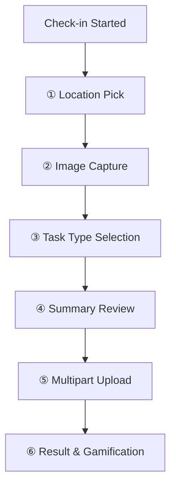

# Core Workflows

The Check-in flow is the primary user interaction in the Rayuela Mobile application.

## 📷 Check-in Flow

A volunteer records a field observation with GPS coordinates, a task type, and up to 3 photos. This data is submitted as a multipart/form-data request.

### Step-by-Step Flow

### 1. Location Pick
Uses `flutter_map` with OpenStreetMap (OSM) tiles. The user can tap the map to place a pin or use their current GPS location.

### 2. Image Capture
Uses the `image_picker` plugin. Volunteers can take new photos or select them from the gallery (up to 3 images per check-in).

### 3. Task Type Selection
The user selects a task type from the list provided by the project (e.g., "Observation", "Photo Report").

### 4. Multipart Upload
The submission is handled by `CheckinsRemoteSource`.

*   **Endpoint**: `POST /checkin`
*   **Payload**: `FormData` containing:
    *   `latitude`, `longitude`
    *   `datetime`
    *   `projectId`
    *   `taskType`
    *   `files`: Up to 3 image files (JPEG/PNG/HEIC/WEBP)
*   **Timeout**: 90 seconds (to account for slow mobile uploads)

### 5. Result & Gamification
Upon success, the backend returns a `CheckinResult` entity containing points earned, new total, and any badges awarded. This is displayed immediately to the user.
